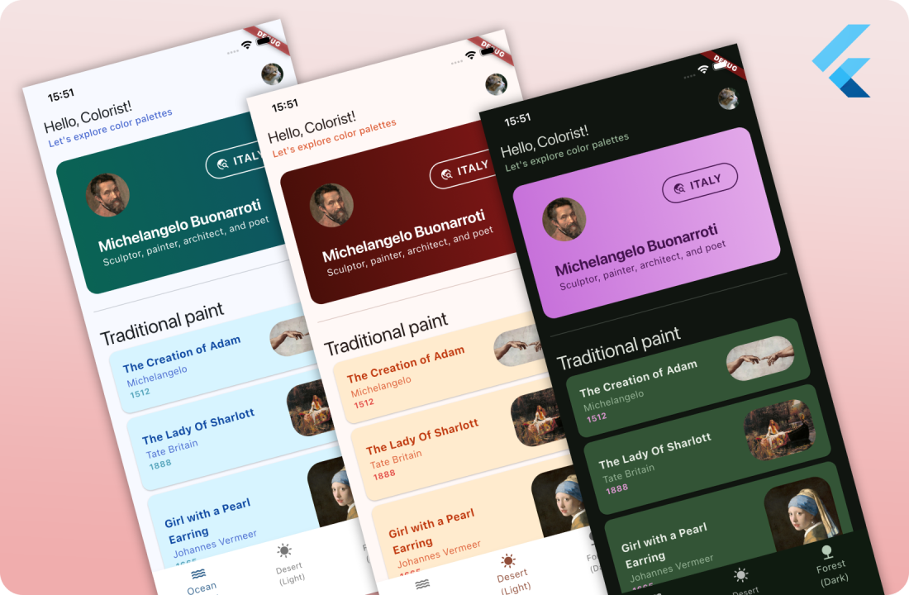

# Colorist

## Palette Generator and Theme Manager Plugin

🎨👨‍🎨 **Colorist** is a simple Flutter package, helping you manage all your custom theming needs from one place. Colorist is most suitable for apps with high level of UI customization, where a range of **custom-named** colors is required for easy development and design management.

<table>
  <tr>
    <td>
      
    </td>
    <td>
      
    </td>
  </tr>
</table>

---

### ℹ️ Notice

> This is the root repository for 3 plugins compositing **Colorist**:
>
> - colorist
> - colorist_annotations
> - colorist_builder
>
> For instructions on how to use install and use the package, please refer to the **`Colorist`** package `README.md`, or _`pub.dev`_ page.

### 🤝 Contribution

If you have any ideas, bugs or improvements you wish to share, please know that all contributions are welcome! 😊 Currently, the project is maintained by a single developer, but I aim to expand this package for easier use and development.
